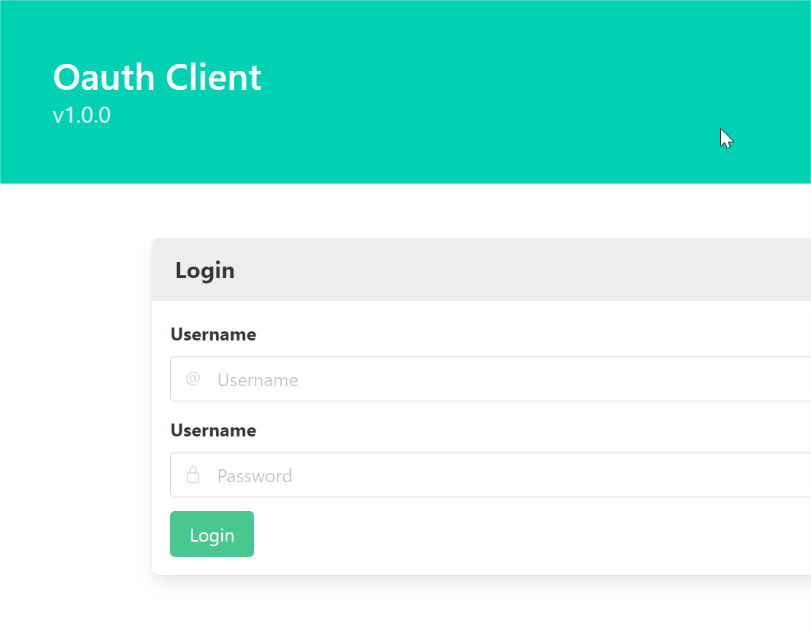
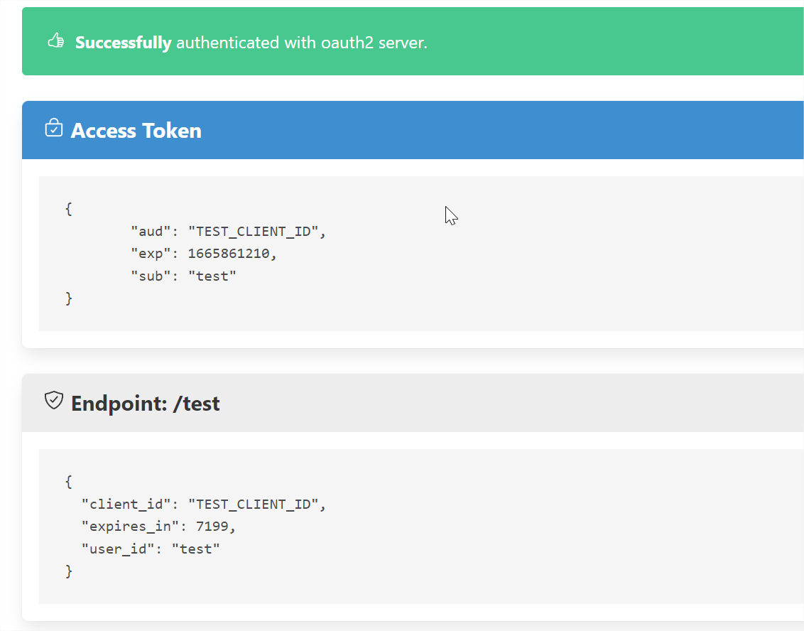
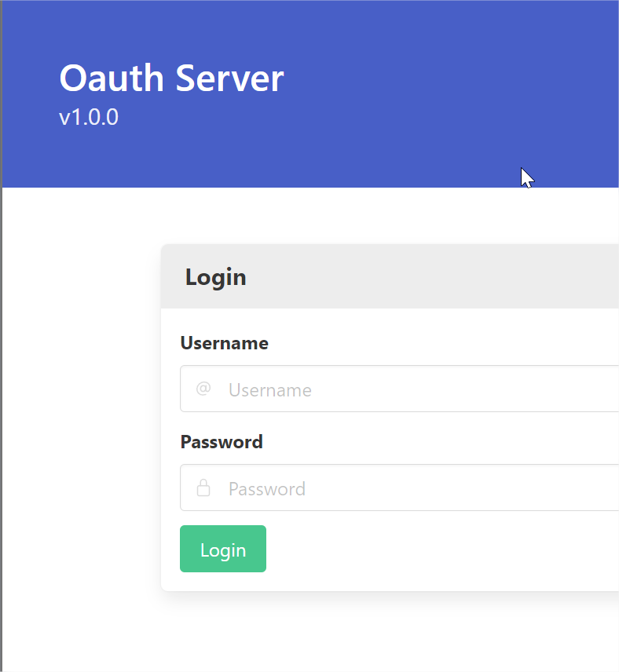

# OAuth Showcase

This is a simple showcase of the OAuth 2.0 authorization code flow written in GO. With a server and a client.
Both components are fully customizable and can be used as a template for your own projects.

## Client

## Server

